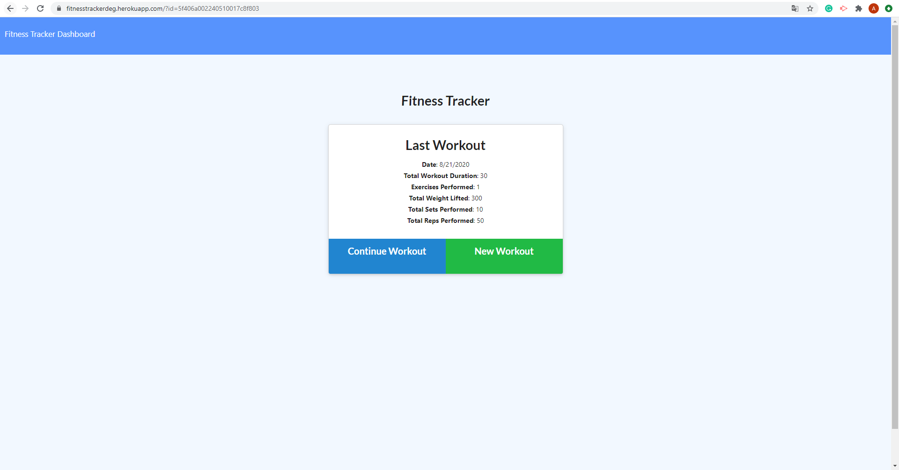
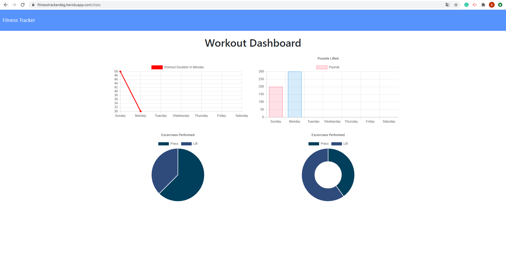
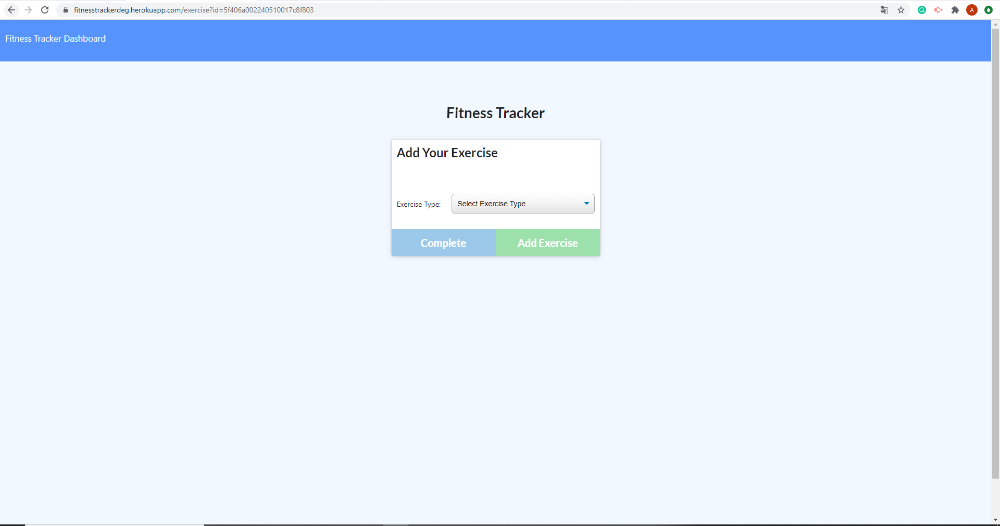

# Fitness Tracker

- Link to
  [Heroku ](https://fitnesstrackerdeg.herokuapp.com/)
  and
  [GitHub ](https://github.com/DEG18/Fitness-Tracker-)

### Table of Contents

1. [Description](#description)
2. [Usage](#usage)
4. [License](#license)
5. [Contributing](#contributing)
6. [Questions](#questions)

### Description

- This APP is for people who love scientific fitness!

- They can use this software to record the exercise type, weight, time, and number of times a day. 

- User can go to the Dashboard to see the resulte in data images of a whole week of fitness, which can make people who love fitness more scientific fitness!

### Usage

- Our user can click the link go to the fitness tracker homepage, to start a new exercise, click "New Workout" button, and it will bring the user to input what kind of exercise form.

- In one day, if the user wants to add a new exercise, click the "Continue Workout" button to add a new exercise. 

- After user completed workout, user can click Dashboard and it will show the resulted of user's Workout throught out the week!

### License

- MIT

### Contributing

- Luyu Zeng

### Questions
##### Email:
- zengluyu252@gmail.com

### Screen Shots

